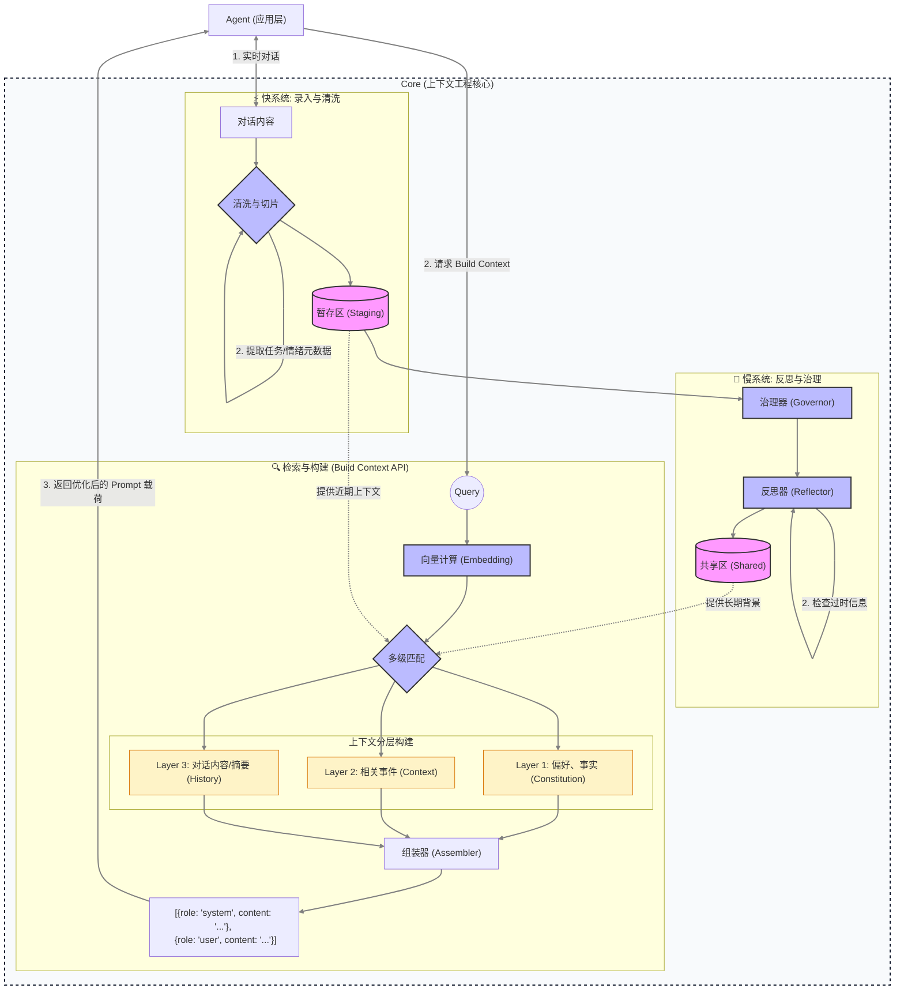

# Agentic 动态进化记忆架构 (DEMA) 设计文档

## 1. 概述 (Overview)

本以此文档描述 `agentic` 项目的跨 Agent 上下文共享与记忆进化机制。该架构旨在解决传统 LLM 应用“记忆遗忘”、“上下文窗口限制”及“信息无法跨会话沉淀”的问题。

核心理念：**双速架构 (Dual-Speed Architecture)**
- **快系统 (Fast System)**: 实时交互，将对话清洗为“事实切片”存入暂存区。
- **慢系统 (Slow System)**: 异步反思，在后台将暂存区的事实进行冲突检测、去噪、合并，演进为长期的“共享经验”。

---

## 2. 核心数据模型 (Data Models)

利用 Qdrant 的 Vector + Payload 特性，构建两个物理隔离的存储区。

### 2.1 暂存区 (Staging Area / Episodic Memory)
*   **Collection Name**: `mem_staging`
*   **用途**: 存储刚结束对话的原始事实，未经验证，高时效性。
*   **保留策略**: 反思处理后删除 (Move-on-Write)。

| 字段 | 类型 | 说明 |
| :--- | :--- | :--- |
| `id` | UUID | 唯一标识 |
| `vector` | Float32[] | 文本向量 (`text-embedding-3-small`) |
| `content` | String | 清洗后的事实文本 (无寒暄) |
| `source_session`| String | 来源会话 ID |
| `created_at` | Int64 | Unix 时间戳 |
| `status` | String | `pending` (待处理) \| `processing` (处理中) |

### 2.2 共享区 (Shared Area / Semantic Memory)
*   **Collection Name**: `mem_shared`
*   **用途**: 存储经过验证的偏好、经验范式、核心知识。
*   **演进策略**: 支持版本控制、置信度权重和软删除。

| 字段 | 类型 | 说明 |
| :--- | :--- | :--- |
| `id` | UUID | 唯一标识 |
| `vector` | Float32[] | 核心内容的向量 |
| `content` | String | **可演进**的知识文本 |
| `topic` | String | 聚类主题 (e.g., "coding_style", "user_profile") |
| `confidence` | Float | 置信度 (0.0 - 1.0) |
| `version` | Int | 版本号，每次演进 +1 |
| `status` | String | `active` (生效) \| `deprecated` (过时) \| `disputed` (争议) |
| `last_verified` | Int64 | 上次被反思机制确认的时间 |
| `evidence_refs` | List[ID] | 支撑该记忆的 Staging ID 列表 (溯源) |

---

## 3. 系统架构与组件 (Architecture & Components)

### 3.1 组件概览

### 3.2 关键模块职责

1.  **Sanitizer (清洗器 - Python/LLM)**
    *   **输入**: 原始对话内容。
    *   **功能**: 
        *   **去噪**: 移除“你好”、“谢谢”、重复尝试等无效寒暄。
        *   **切片 (Slicing)**: 将长对话切分为独立的、原子化的事实碎片。
        *   **元数据提取**: 自动识别任务类型、用户偏好偏好及交互时的情绪状态。
    *   **输出**: 存入 `Staging` 的结构化事实。

2.  **Memory Governor (治理器 - Go Core)**
    *   **性质**: 驻留内存的后台 Worker (Goroutine)。
    *   **触发机制**: 系统空闲 (Idle) 或 Staging 积压达到阈值。
    *   **职责**: 调度反思流程，管理并发锁，并执行 Qdrant 的物理更新。

3.  **Reflector (反思器 - Python/LLM)**
    *   **功能**: 认知仲裁与记忆进化。
    *   **逻辑**: 
        *   **冲突检测**: 发现新事实与旧记忆之间的矛盾。
        *   **过时检查**: 识别不再生效的陈旧信息。
        *   **指令生成**: 输出 `Evolve` (改写), `Deprecate` (废弃) 或 `Create` (新增) 指令。

4.  **Assembler (组装器 - Go Core/Build Context API)**
    *   **核心逻辑**: 按照“三层架构”动态重构 LLM 上下文。
        *   **Layer 1 (Constitution)**: 长期背景。从 `Shared` 区提取最高置信度的全局偏好与核心事实。
        *   **Layer 2 (Context)**: 中短期线索。通过向量匹配从 `Staging` 和 `Shared` 检索与当前 Query 相关的事件。
        *   **Layer 3 (History)**: 即时记忆。当前会话最邻近的对话文本或自动生成的语义摘要。
    *   **输出格式**: 统一封装为结构化的消息载荷 `[{role: "system", content: "..."}, {role: "user", content: "..."}]`。

---

## 4. 核心流程 (Workflows)

### 4.1 数据录入与清洗流程 (Ingestion)
1.  **Capture**: 会话结束或定期触发数据采集。
2.  **Sanitize**: 调用 Python 适配器进行去噪、切片并附加任务/情绪元数据。
3.  **Persistence**: 写入 `mem_staging`，状态标记为 `pending`。

### 4.2 检索与构建流程 (Build Context)
1.  **Vectorize**: 对用户输入 Query 进行向量化计算。
2.  **Multi-match**: 在 `Staging` (近期) 和 `Shared` (长期) 中进行多级语义匹配。
3.  **Layered Assembly**: 组装器按 L1 -> L2 -> L3 顺序填充 Prompt 模板。
4.  **Response**: 返回完全格式化的消息载荷，Agent 直接转发给 LLM。

### 4.3 反思与治理流程 (Reflection)
1.  **Retrieve**: Governor 拉取待处理 Facts。
2.  **Cognition**: Reflector 对比旧记忆，处理冲突并决策是否需要演进或废弃。
3.  **Mutation**: 将决策结果同步至 `mem_shared`，并清理 `mem_staging`。

---

## 5. 架构原则 (Architectural Principles)

为保证新架构与现有代码的低耦合，开发时须遵循以下原则：

1.  **非侵入式采集**: 利用现有 `Pipeline` 的输出作为数据源，通过异步任务队列（Worker Pool）触发 `Ingestion`，不阻塞正常的对话 API 响应。
2.  **Pass 插件化**: 所有的 `Assembler` 逻辑必须封装为标准的 `pipeline.Pass` 接口实现，通过配置动态加载 L1/L2/L3 层级。
3.  **决策逻辑外置**: `Sanitizer` 和 `Reflector` 的具体 Prompt 和决策算法驻留在 `LLM Gateway` 中，Go Core 仅作为流程编排器。
4.  **存储协议化**: 定义 `VectorRepo` 抽象接口，隔离 Qdrant 具体实现，便于后续在本地测试时切换为 Mock 实现或内存索引。

---

## 6. 实施路线图 (Implementation Roadmap)

### Phase 1: 基础设施 (Infrastructure)
- [ ] **Qdrant**: 编写脚本创建 `mem_staging` 和 `mem_shared` 集合。
- [ ] **Go Models**: 定义 `StagingFact` 和 `SharedMemoryUnit` 结构体。
- [ ] **Configuration**: 在 `config.yaml` 或环境变量中添加记忆相关配置 (阈值、开关)。

### Phase 2: 采集与清洗 (Ingestion)
- [ ] **Python**: 实现 `Sanitizer` Adapter (Prompt 编写与调试)。
- [ ] **Go Pipeline**: 实现 `SanitizePass` (或在会话结束钩子中)，对接 Python 接口。
- [ ] **Integration**: 确保对话结束数据能进入 Qdrant `mem_staging`。

### Phase 3: 反思内核 (Reflection Core)
- [ ] **Go Governor**: 实现后台 Ticker 和 Worker 框架，处理并发锁。
- [ ] **Python Reflector**: 编写复杂的 `Reflector` Adapter，处理冲突检测逻辑。
- [ ] **Go Mutation**: 实现对 Qdrant 的复杂更新操作 (Update Payload, Delete, Upsert)。

### Phase 4: 检索融合 (Retrieval Fusion)
- [ ] **RAG Upgrade**: 改造 `RAGPass`，支持双源检索 (Shared + Staging)。
- [ ] **Context Builder**: 优化 System Prompt，合理展示长期记忆 vs 短期事实。

---
*Created: 2026-01-22*
